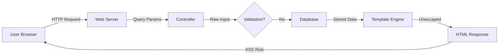
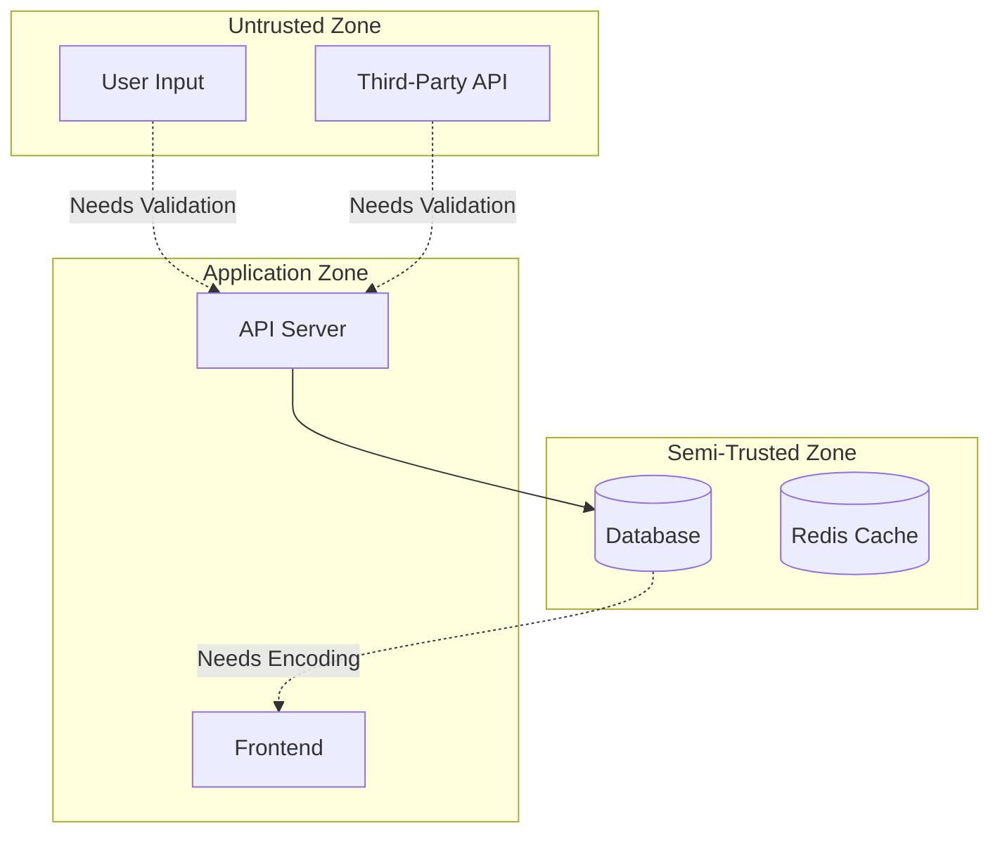

# Security Audit Skill

Perform comprehensive security audits of web applications with focus on input validation, sanitization, and encoding vulnerabilities.

## Audit Workflow

The security audit follows this bidirectional analysis approach:

1. **Codebase Discovery** - Map application structure and identify technologies
2. **Architecture Mapping** - Create visual diagrams of data flow and trust boundaries
3. **Input Enumeration** - Identify ALL potential untrusted data sources (broad interpretation)
4. **Sink Identification** - Find all security-sensitive operations
5. **Forward Flow Analysis** - Trace inputs → sinks for vulnerabilities
6. **Backward Flow Analysis** - Trace sinks → inputs for missed cases
7. **Sub-Agent Validation** - Validate findings with confidence scoring
8. **Report Generation** - Create audit-ready report with findings and remediation

## Input Classification (Broad Interpretation)

Treat the following as untrusted or semi-trusted inputs:

**Untrusted Inputs (Highest Risk):**
- User-supplied data: query parameters, POST data, cookies, headers
- File uploads: filename, content, metadata
- WebSocket/SSE messages
- Third-party API responses
- External service data (payment processors, analytics, etc.)
- Data from uncontrolled domains/origins

**Semi-Trusted Inputs (Compromise Risk):**
- Database content (could be compromised via SQLi or direct DB access)
- Cache/session storage (could be tampered)
- Configuration files from untrusted sources
- Environment variables in shared hosting
- Data from internal APIs outside current project scope
- Logs or audit trails (could contain injected content)

Unless documentation explicitly designates specific inputs as trusted, apply broad interpretation.

## Architecture Mapping and Diagrams

Create visual diagrams to illustrate the application's data flow and security boundaries. These diagrams help stakeholders understand the attack surface and data flow paths.

### Required Diagrams

**1. Data Flow Diagram**
Show how data moves through the application:
- External inputs (user browsers, APIs, third parties)
- Application components (frontend, backend, database, cache)
- Data transformations (validation, sanitization, encoding)
- Output destinations (rendered pages, API responses, logs)

Use Mermaid for creating diagrams:



**2. Trust Boundary Diagram**
Identify trust boundaries and data crossing them:
- External trust boundary (internet → application)
- Internal boundaries (database → application code)
- Component boundaries (frontend ← backend API)
- Mark each boundary with validation/sanitization status



**3. Attack Surface Map**
Visualize all entry points and potential attack vectors:
- List all inputs with their risk levels
- Show which sinks each input can reach
- Highlight unprotected paths

Create these diagrams and include them in the final report to help non-technical stakeholders understand the security posture.

## Critical Security Sinks

Identify these vulnerability classes and their sinks:

**XSS (Cross-Site Scripting):**
- Direct DOM manipulation: `innerHTML`, `outerHTML`, `document.write()`
- Template injection: unescaped template variables
- JavaScript execution: `eval()`, `Function()`, `setTimeout(string)`
- URL sinks: `href`, `src` attributes with user data
- Event handlers: `onclick`, `onerror`, etc. with dynamic content

**SQL Injection:**
- String concatenation in queries
- Unparameterized queries
- ORM raw queries without sanitization
- Dynamic table/column names from user input

**Command Injection:**
- `exec()`, `system()`, `shell_exec()`, `spawn()`
- Template command execution
- Unsafe subprocess calls

**Path Traversal:**
- File operations with user-controlled paths
- `include`, `require` with dynamic paths
- Archive extraction without validation

**Server-Side Request Forgery (SSRF):**
- HTTP requests with user-controlled URLs
- DNS lookups with user input
- Internal API calls with dynamic endpoints

**Additional Sinks:**
- LDAP queries, XPath queries, XML parsing
- Deserialization of untrusted data
- File uploads without validation
- Redirect locations from user input

Consult `references/vulnerability-patterns.md` for detailed patterns.

## Bidirectional Analysis Approach

### Forward Analysis (Input → Sink)
For each identified input:
1. Trace data flow through the application
2. Track transformations (encoding, sanitization, validation)
3. Identify if data reaches security sinks without proper protection
4. Note validation/sanitization applied at each step

### Backward Analysis (Sink → Input)
For each identified sink:
1. Trace data origin backward
2. Identify all possible data sources
3. Check if ANY path lacks proper validation
4. Cross-reference with input enumeration to find missed inputs

**Both analyses must be performed** to achieve comprehensive coverage.

## Sub-Agent Validation Framework

For each potential finding, spawn a validation sub-agent to:

1. **Verify the vulnerability path exists**
2. **Assess exploitability**
3. **Check for framework protections** (auto-escaping, prepared statements, etc.)
4. **Assign confidence score** (0-100)

### Confidence Scoring Criteria

**High Confidence (80-100):**
- Clear direct path from untrusted input to dangerous sink
- No sanitization/encoding present
- No framework protection
- Easily exploitable

**Medium Confidence (50-79):**
- Path exists but includes some validation (insufficient/bypassable)
- Partial framework protection
- Requires specific conditions to exploit

**Low Confidence (20-49):**
- Indirect path or multiple assumptions required
- Strong validation present but potentially incomplete
- Framework provides partial protection

**False Positive (0-19):**
- Proper validation/encoding confirmed
- Framework fully protects against this vector
- Input cannot reach sink, or sink is not actually dangerous

**Confidence Threshold:** Report findings with confidence ≥ 50 as primary findings. List 20-49 scores separately as "low confidence / potential false positives".

Use `scripts/validate_finding.py` to systematically validate findings.

## Best Practices Recommendations

For each finding, recommend specific mitigations:

**General Principles:**
- Input validation: whitelist > blacklist
- Use framework-provided security features
- Apply defense in depth (validate at multiple layers)
- Encode/escape at output context, not input
- Use parameterized queries/prepared statements
- Implement Content Security Policy (CSP)

**Context-Specific Encoding:**
- HTML context: HTML entity encoding
- JavaScript context: JavaScript escaping
- URL context: URL encoding
- SQL context: parameterized queries
- Command context: avoid shell execution, use safe APIs

Consult `references/secure-coding-practices.md` for framework-specific guidance.

## Output Format

Generate TWO outputs:

### 1. Technical Analysis Report (Complete)
Comprehensive technical report with all findings:

**Executive Summary**
- Audit scope and methodology
- Application architecture overview
- Total findings by confidence level
- Critical risk summary
- Key recommendations

**Architecture Diagrams**
- Data flow diagram showing input → sink paths
- Trust boundary diagram with validation points
- Attack surface map with risk levels

**High-Confidence Findings (≥80 confidence)**
For each finding:
- **Vulnerability Type:** XSS, SQLi, etc.
- **Severity:** Critical/High/Medium
- **Location:** File, function, line number
- **Input Source:** Where untrusted data originates
- **Data Flow:** Step-by-step trace from input → sink
- **Proof of Concept:** Example exploit scenario
- **Confidence Score:** 80-100 with justification
- **Impact Assessment:** What attacker can achieve
- **Affected Assets:** Data/systems at risk

**Medium-Confidence Findings (50-79 confidence)**
Same structure as high-confidence findings.

**Low-Confidence Findings (20-49 confidence)**
Listed separately with notes on why confidence is lower and what would confirm the vulnerability.

**False Positives (0-19 confidence)**
Documented for transparency, showing what was checked, why it's not vulnerable, and what protections are in place.

**Complete Inventories**
- Input Inventory: All identified inputs with classifications
- Sink Inventory: All security-sensitive operations
- Validation Coverage Map: Which inputs are properly validated

### 2. Audit Report (High-Confidence Findings Only)

Professional audit report ready for inclusion in formal security documentation:

---

# Security Audit Report: Input Validation Assessment

## Executive Summary

[Date], [Auditor Name/Organization]

This report presents findings from a comprehensive security audit focusing on input validation, sanitization, and encoding practices. The assessment identified [X] high-confidence vulnerabilities requiring immediate attention.

### Scope
- Application: [Name/URL]
- Assessment Period: [Dates]
- Focus Areas: Input validation, XSS, SQL injection, command injection, path traversal, SSRF
- Methodology: Static code analysis with bidirectional data flow tracing

### Risk Summary
- **Critical Risk:** [X] findings
- **High Risk:** [X] findings  
- **Medium Risk:** [X] findings

---

## Architecture Overview

[Include data flow diagram]

The application follows a [architecture pattern] with the following key components:
- [Component 1]: [Description]
- [Component 2]: [Description]

[Include trust boundary diagram]

**Trust Boundaries Identified:**
- External → Application: [Validation status]
- Database → Application: [Validation status]
- Third-party APIs → Application: [Validation status]

---

## High-Confidence Findings

### Finding 1: [Vulnerability Type] in [Location]

**Severity:** Critical/High/Medium  
**Confidence Score:** [Score]/100  
**CWE Reference:** CWE-[Number]

**Description:**  
[Clear explanation of the vulnerability in business terms]

**Technical Details:**
- **Location:** `[file path]:[line number]` in function `[function name]`
- **Vulnerable Code:**
```[language]
[code snippet]
```

- **Input Source:** [Where the tainted data originates]
- **Data Flow Path:**
  1. [Step 1: Input entry point]
  2. [Step 2: Processing/transformation]
  3. [Step 3: Dangerous sink]

**Proof of Concept:**
```
[Example attack payload and expected outcome]
```

**Impact Assessment:**
- **Confidentiality:** [High/Medium/Low - explain]
- **Integrity:** [High/Medium/Low - explain]
- **Availability:** [High/Medium/Low - explain]
- **Business Impact:** [Real-world consequences]

**Validation Steps:**
To confirm this vulnerability:
1. [Manual test step 1]
2. [Manual test step 2]
3. [Expected result that confirms vulnerability]

**Recommended Fix:**
```[language]
// Before (vulnerable):
[vulnerable code]

// After (secure):
[fixed code with explanation]
```

**Implementation Steps:**
1. [Specific action 1]
2. [Specific action 2]
3. [Verification step]

**References:**
- OWASP: [Link to relevant OWASP guidance]
- Framework Documentation: [Link to framework security docs]
- CWE: [Link to CWE entry]

---

[Repeat for each high-confidence finding]

---

## Recommendations

### Immediate Actions (Critical Priority)
1. **[Finding reference]:** [Specific action required]
   - Timeline: [Immediate/Within 1 week]
   - Effort: [Low/Medium/High]
   
2. [Additional critical findings]

### Short-Term Actions (High Priority)
1. **[Finding reference]:** [Specific action required]
   - Timeline: [Within 2-4 weeks]
   - Effort: [Low/Medium/High]

### Long-Term Improvements
1. **Input Validation Framework:** Implement centralized input validation
2. **Output Encoding:** Adopt consistent output encoding practices
3. **Security Testing:** Integrate automated security scanning in CI/CD
4. **Developer Training:** Security awareness training on secure coding
5. **Code Review:** Add security-focused code review checklist

### Defense in Depth Recommendations
- Implement Content Security Policy (CSP)
- Enable Web Application Firewall (WAF)
- Deploy Database Activity Monitoring
- Implement Security Headers
- Enable audit logging for sensitive operations

---

## Validation and Testing Guide

### How to Verify Findings

**For XSS Vulnerabilities:**
1. Identify input point from finding
2. Submit test payload: `<script>alert('XSS')</script>`
3. Check if script executes in browser
4. Verify with browser developer tools

**For SQL Injection:**
1. Identify input point from finding
2. Submit test payload: `' OR '1'='1`
3. Monitor database queries (if possible)
4. Check for unexpected data returned

**For Command Injection:**
1. Identify input point from finding
2. Submit test payload: `; echo "VULNERABLE"`
3. Check if command executes on server
4. Review application logs

[Continue for other vulnerability types]

### Tools for Verification
- Burp Suite Professional
- OWASP ZAP
- SQLMap (for SQLi)
- Browser Developer Tools (for XSS)

---

## Remediation Tracking

| Finding ID | Severity | Status | Assigned To | Target Date | Verified |
|------------|----------|--------|-------------|-------------|----------|
| F001       | Critical | Open   | [Team/Person] | [Date]    | No       |
| F002       | High     | Open   | [Team/Person] | [Date]    | No       |

---

## Appendices

### Appendix A: Input Inventory
[Complete list of all inputs identified]

### Appendix B: Sink Inventory  
[Complete list of all security-sensitive sinks]

### Appendix C: Validation Coverage Matrix
[Matrix showing which inputs have which validations]

### Appendix D: Framework Security Features
[Documentation of framework protections in use]

---

## Methodology Notes

This assessment used:
- Static code analysis with pattern matching
- Bidirectional data flow analysis (forward and backward)
- Sub-agent validation with confidence scoring
- Manual verification of critical paths

**Confidence Scoring:**
- 80-100: Clear vulnerability with verified exploitation path
- 50-79: Likely vulnerability requiring specific conditions
- 20-49: Potential issue requiring manual investigation
- 0-19: Protected by existing controls

**Limitations:**
- Static analysis cannot detect all runtime vulnerabilities
- Some framework protections may not be fully recognized
- Complex data flows may require manual tracing
- Actual exploitability may vary based on deployment environment

---

**Report Prepared By:** [Auditor Name]  
**Date:** [Date]  
**Version:** 1.0

---

## Usage Notes

- Always run both forward and backward analysis
- Create architecture diagrams for stakeholder communication
- Generate BOTH technical analysis and audit-ready report
- Use sub-agents to validate each finding independently
- When uncertain about a framework's protections, research documentation or test
- For large codebases, process in sections and aggregate findings
- Include code snippets in findings for clarity
- Provide specific, actionable remediation steps with timelines
- Include validation steps so findings can be independently verified
- Ensure audit report is professional and ready for formal documentation

## Scripts Reference

- `scripts/find_sinks.py` - Pattern matching for common sink patterns
- `scripts/trace_dataflow.py` - Data flow tracing utilities
- `scripts/validate_finding.py` - Sub-agent validation framework

## References

- `references/vulnerability-patterns.md` - Detailed vulnerability patterns by type
- `references/secure-coding-practices.md` - Framework-specific security guidance
- `references/encoding-reference.md` - Context-appropriate encoding methods
- `references/report-templates.md` - Professional audit report templates and examples
